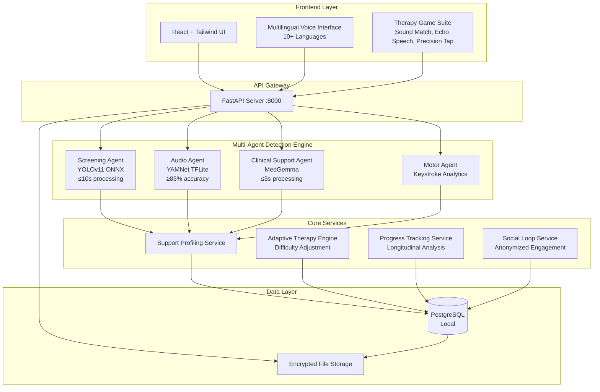
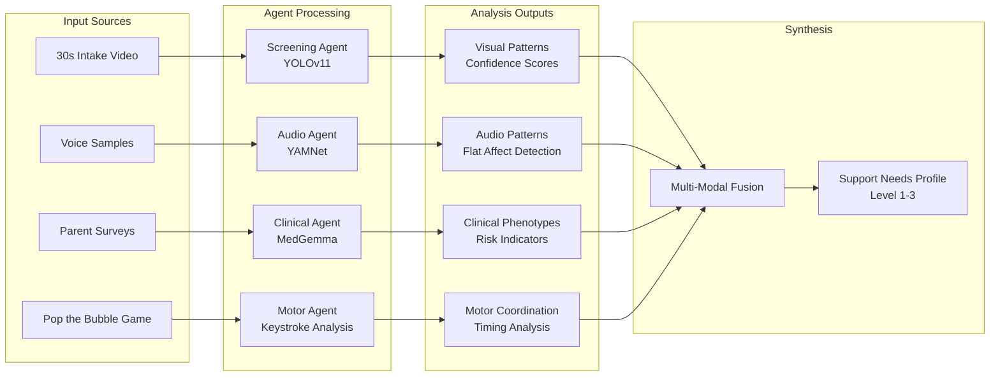
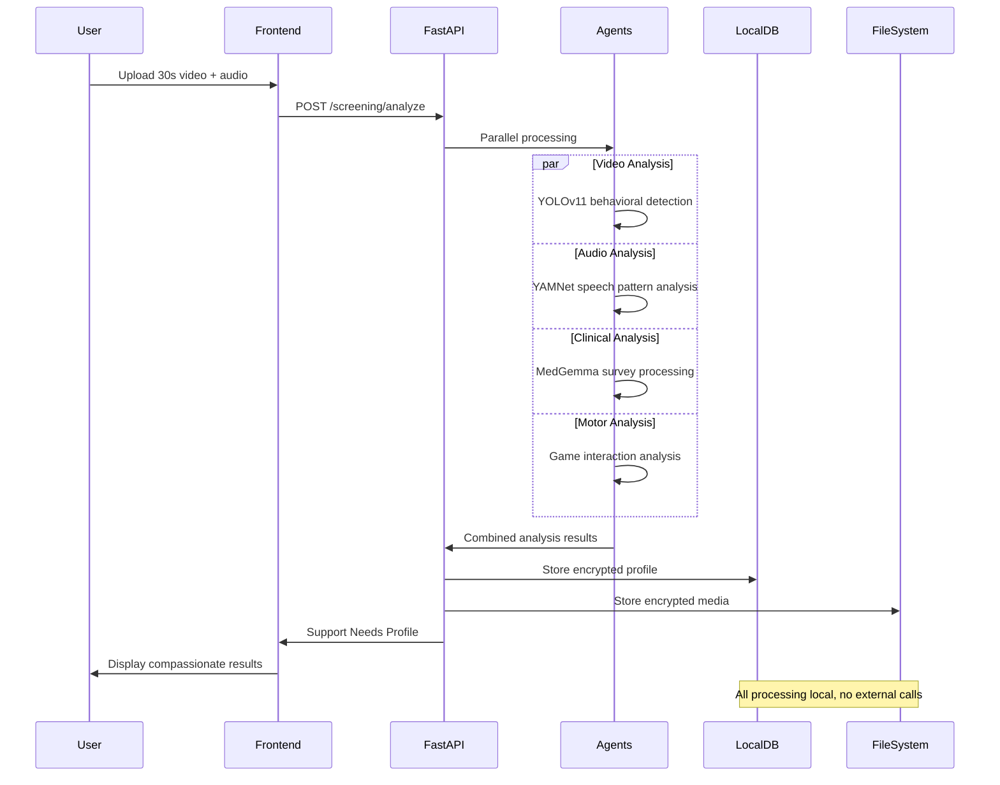

# Design Document: ASD Community Support Platform

## Overview

The ASD Community Support platform is an offline-first, AI-enabled autism screening and support system designed for deployment in underserved healthcare settings. The platform employs a multi-agent architecture with four specialized AI agents working in concert to provide comprehensive autism screening, followed by adaptive therapy games and community support features.

The system addresses critical healthcare gaps by reducing diagnostic delays from 6+ years to under 3 years through objective, multilingual screening tools that can operate without internet connectivity. The platform emphasizes privacy-by-design with all sensitive processing occurring locally, making it suitable for resource-constrained environments while maintaining HIPAA compliance.

## Architecture

### High-Level System Architecture



### Multi-Agent Detection Architecture

The detection engine employs four specialized agents, each optimized for specific behavioral modalities:



## Components and Interfaces

### 1. Screening Agent (Vision Processing)

**Technology**: YOLOv11 in ONNX format for cross-platform compatibility
**Input**: 30-second video recordings from intake sessions
**Processing**: Real-time detection of repetitive behavioral patterns, gaze tracking, and facial dynamics
**Output**: Behavioral pattern confidence scores and temporal analysis with 10-second processing time

```python
class ScreeningAgent:
    def __init__(self, model_path: str):
        self.model = onnx.load(model_path)
        self.session = onnxruntime.InferenceSession(model_path)
        self.processing_timeout = 10  # seconds for 30-second video
    
    def analyze_video(self, video_path: str) -> ScreeningResult:
        # Process 30-second video for behavioral patterns within 10 seconds
        # Return confidence scores for repetitive behaviors, gaze patterns
        pass
    
    def detect_behavioral_markers(self, frames: List[np.ndarray]) -> BehavioralMarkers:
        # Detect eye contact avoidance, repetitive motions, response to stimuli
        # Quantify behavioral indicators with confidence scores
        pass
    
    def track_temporal_changes(self, multiple_videos: List[str]) -> TemporalAnalysis:
        # Track behavioral changes over multiple video analyses
        pass
```

**Key Features**:
- Detects repetitive hand movements, body rocking, and stereotypical behaviors
- Analyzes gaze patterns and eye contact frequency
- Measures response latency to name calling and social stimuli
- Provides temporal analysis of behavioral consistency
- Completes 30-second video analysis within 10 seconds
- Tracks behavioral changes over time across multiple sessions

**Design Decision**: YOLOv11 ONNX format ensures cross-platform compatibility while meeting the 10-second processing requirement for 30-second videos.

### 2. Audio Agent (Speech Processing)

**Technology**: Fine-tuned YAMNet in TensorFlow Lite format
**Input**: Audio recordings from screening sessions and therapy interactions
**Processing**: Detection of flat affect, echolalia, and atypical speech patterns with multilingual support
**Output**: Speech pattern analysis with clinical relevance scores

```python
class AudioAgent:
    def __init__(self, model_path: str):
        self.interpreter = tf.lite.Interpreter(model_path=model_path)
        self.interpreter.allocate_tensors()
        self.supported_languages = ['en', 'es', 'fr', 'de', 'it', 'pt', 'ru', 'zh', 'ja', 'ar']
    
    def analyze_speech_patterns(self, audio_data: np.ndarray, language: str = 'en') -> SpeechAnalysis:
        # Detect flat affect, echolalia, prosody abnormalities in specified language
        pass
    
    def detect_vocal_markers(self, audio_segments: List[np.ndarray]) -> VocalMarkers:
        # Identify repetitive speech, unusual intonation patterns
        pass
```

**Key Features**:
- Detects flat affect through prosody analysis
- Identifies echolalia and repetitive speech patterns
- Analyzes speech timing and rhythm abnormalities
- Supports multilingual processing for diverse populations (10+ languages)
- Maintains 85%+ accuracy for target speech pattern detection

**Design Decision**: YAMNet TensorFlow Lite provides efficient multilingual audio processing while meeting the 85% accuracy requirement for speech pattern detection.

### 3. Clinical Support Agent (Cognitive Processing)

**Technology**: MedGemma 4B model for medical text comprehension
**Input**: Parent survey responses, clinical questionnaires (M-CHAT-R/F, SCQ, PEDS, CARS)
**Processing**: Maps responses to clinical phenotypes and risk indicators with 5-second processing time
**Output**: Clinical assessment with evidence-based recommendations

```python
class ClinicalSupportAgent:
    def __init__(self, model_path: str):
        self.model = transformers.AutoModelForCausalLM.from_pretrained(model_path)
        self.tokenizer = transformers.AutoTokenizer.from_pretrained(model_path)
        self.processing_timeout = 5  # seconds for phenotype classification
    
    def map_survey_responses(self, responses: Dict[str, Any]) -> ClinicalPhenotype:
        # Map M-CHAT-R/F, SCQ responses to clinical indicators within 5 seconds
        pass
    
    def generate_recommendations(self, phenotype: ClinicalPhenotype) -> ClinicalRecommendations:
        # Generate evidence-based intervention recommendations
        # Include specialist referral suggestions with urgency levels
        pass
    
    def generate_clinician_report(self, assessment_data: AssessmentData) -> ClinicianReport:
        # Generate clinician-ready reports with objective behavioral data
        pass
```

**Key Features**:
- Processes standardized autism screening tools (M-CHAT-R/F, SCQ, PEDS, CARS)
- Maps responses to DSM-5 criteria and clinical phenotypes
- Generates strength-based support recommendations
- Provides referral guidance based on risk levels
- Completes phenotype classifications within 5 seconds
- Generates clinician-ready reports with objective data

**Design Decision**: MedGemma 4B provides medical-grade text comprehension while meeting the 5-second processing requirement for clinical phenotype mapping.

### 4. Motor Agent (Sensor Processing)

**Technology**: Custom keystroke dynamics analysis with MediaPipe integration
**Input**: Interaction data from "Pop the Bubble" therapy game
**Processing**: Analysis of motor coordination, timing precision, and movement patterns
**Output**: Motor skill assessment and coordination metrics

```python
class MotorAgent:
    def __init__(self):
        self.mediapipe_hands = mp.solutions.hands.Hands()
        self.keystroke_analyzer = KeystrokeDynamicsAnalyzer()
    
    def analyze_game_interactions(self, interaction_data: GameInteractionData) -> MotorAnalysis:
        # Analyze timing, precision, coordination patterns
        pass
    
    def detect_coordination_gaps(self, movement_data: MovementData) -> CoordinationMetrics:
        # Identify fine/gross motor coordination issues
        pass
```

**Key Features**:
- Measures reaction time and movement precision
- Analyzes hand-eye coordination through game interactions
- Detects motor planning difficulties
- Tracks improvement over therapy sessions

### 5. Support Profiling Service

Synthesizes multi-agent outputs into compassionate support profiles:

```python
class SupportProfilingService:
    def synthesize_assessment(self, 
                            visual_analysis: ScreeningResult,
                            audio_analysis: SpeechAnalysis,
                            clinical_analysis: ClinicalPhenotype,
                            motor_analysis: MotorAnalysis) -> SupportNeedsProfile:
        # Combine all agent outputs into unified profile
        pass
    
    def generate_support_level(self, combined_analysis: CombinedAnalysis) -> SupportLevel:
        # Determine Level 1-3 support needs classification
        pass
```

### 6. Multilingual Voice Interface System

Provides comprehensive multilingual support for diverse populations:

```python
class MultilingualVoiceInterface:
    def __init__(self):
        self.supported_languages = [
            'en', 'es', 'fr', 'de', 'it', 'pt', 'ru', 'zh', 'ja', 'ar'
        ]  # 10+ languages as required
        self.current_language = 'en'
        self.voice_processors = {}
        self.session_continuity = SessionContinuityManager()
    
    def set_language(self, language_code: str) -> bool:
        # Switch interface language while maintaining session continuity
        if language_code in self.supported_languages:
            self.current_language = language_code
            return True
        return False
    
    def process_voice_command(self, audio_input: np.ndarray) -> VoiceCommandResult:
        # Process voice commands in selected language
        pass
    
    def generate_voice_prompt(self, prompt_type: str, context: Dict) -> AudioPrompt:
        # Generate voice prompts in current language
        pass
    
    def maintain_session_continuity(self, language_switch: str) -> bool:
        # Ensure user progress is maintained during language switches
        pass
```

**Design Decision**: Supporting 10+ languages addresses diverse populations in underserved areas while maintaining session continuity during language switches.

### 7. Adaptive Therapy Engine

Manages the Daily Gym therapy games with adaptive difficulty:

```python
class AdaptiveTherapyEngine:
    def __init__(self):
        self.games = {
            'sound_match': SoundMatchGame(),
            'echo_speech': EchoSpeechGame(),
            'precision_tap': PrecisionTapGame()
        }
    
    def adjust_difficulty(self, game_type: str, performance_metrics: PerformanceMetrics) -> DifficultySettings:
        # Adapt game difficulty based on child's performance
        # Maintain appropriate challenge level without causing frustration
        pass
    
    def track_progress(self, session_data: TherapySessionData) -> ProgressMetrics:
        # Monitor skill development across domains
        pass
    
    def ensure_age_appropriate_interface(self, child_age: int, game_type: str) -> GameInterface:
        # Provide age-appropriate game interfaces and engagement mechanisms
        pass
```

**Design Decision**: The three core games (Sound Match, Echo Speech, Precision Tap) target different developmental domains while maintaining engagement through adaptive difficulty that prevents frustration.

### 8. System Initialization Manager

Ensures all AI components initialize within performance requirements:

```python
class SystemInitializationManager:
    def __init__(self):
        self.initialization_timeout = 30  # seconds
        self.components = [
            'screening_agent', 'audio_agent', 'clinical_agent', 'motor_agent'
        ]
    
    def initialize_system(self) -> InitializationResult:
        # Initialize all AI components within 30 seconds
        start_time = time.time()
        
        for component in self.components:
            self.initialize_component(component)
            
        total_time = time.time() - start_time
        if total_time > self.initialization_timeout:
            raise InitializationTimeoutError("System initialization exceeded 30 seconds")
        
        return InitializationResult(success=True, time_taken=total_time)
    
    def initialize_component(self, component_name: str) -> bool:
        # Initialize individual AI model components
        pass
    
    def ensure_responsive_performance(self, hardware_specs: HardwareSpecs) -> bool:
        # Verify system can maintain responsive performance on minimum hardware
        pass
```

**Design Decision**: 30-second initialization timeout ensures rapid system startup while maintaining responsive performance on minimum hardware specifications.

## Data Models

### Core Data Structures

```python
@dataclass
class SupportNeedsProfile:
    profile_id: str
    child_id: str
    support_level: Literal[1, 2, 3]
    strengths: List[str]
    support_areas: List[SupportArea]
    recommendations: List[Recommendation]
    confidence_score: float
    level_explanation: str  # Clear explanation of support level meaning
    created_at: datetime
    
@dataclass
class SupportArea:
    domain: Literal['communication', 'social', 'behavioral', 'sensory', 'motor']
    severity: Literal['mild', 'moderate', 'significant']
    specific_needs: List[str]
    intervention_strategies: List[str]

@dataclass
class TherapySessionData:
    session_id: str
    child_id: str
    game_type: Literal['sound_match', 'echo_speech', 'precision_tap']
    performance_metrics: PerformanceMetrics
    difficulty_level: int
    duration_minutes: int
    completion_rate: float
    skill_improvements: List[SkillImprovement]
    frustration_indicators: List[str]  # Track frustration to prevent it
    
@dataclass
class PerformanceMetrics:
    accuracy: float
    reaction_time_ms: float
    consistency_score: float
    engagement_level: float
    error_patterns: List[ErrorPattern]

@dataclass
class MultilingualSession:
    session_id: str
    user_id: str
    primary_language: str
    language_switches: List[LanguageSwitch]
    session_continuity_maintained: bool
    
@dataclass
class LanguageSwitch:
    from_language: str
    to_language: str
    timestamp: datetime
    progress_preserved: bool
```

### Database Schema

```sql
-- Core user and assessment tables
CREATE TABLE children (
    id UUID PRIMARY KEY,
    encrypted_name TEXT,
    date_of_birth DATE,
    primary_language VARCHAR(10),
    created_at TIMESTAMP DEFAULT NOW()
);

CREATE TABLE support_profiles (
    id UUID PRIMARY KEY,
    child_id UUID REFERENCES children(id),
    support_level INTEGER CHECK (support_level IN (1, 2, 3)),
    level_explanation TEXT, -- Clear explanation of support level meaning
    profile_data JSONB, -- Encrypted support areas and recommendations
    confidence_score FLOAT,
    created_at TIMESTAMP DEFAULT NOW()
);

CREATE TABLE therapy_sessions (
    id UUID PRIMARY KEY,
    child_id UUID REFERENCES children(id),
    game_type VARCHAR(50) CHECK (game_type IN ('sound_match', 'echo_speech', 'precision_tap')),
    session_data JSONB, -- Performance metrics and progress data
    frustration_indicators JSONB, -- Track frustration prevention
    created_at TIMESTAMP DEFAULT NOW()
);

CREATE TABLE progress_tracking (
    id UUID PRIMARY KEY,
    child_id UUID REFERENCES children(id),
    skill_domain VARCHAR(50),
    baseline_score FLOAT,
    current_score FLOAT,
    improvement_rate FLOAT,
    longitudinal_data JSONB, -- Extended progress tracking over time
    last_updated TIMESTAMP DEFAULT NOW()
);

CREATE TABLE multilingual_sessions (
    id UUID PRIMARY KEY,
    user_id UUID,
    primary_language VARCHAR(10),
    language_switches JSONB, -- Track language switching patterns
    session_continuity_maintained BOOLEAN DEFAULT TRUE,
    created_at TIMESTAMP DEFAULT NOW()
);

CREATE TABLE clinical_reports (
    id UUID PRIMARY KEY,
    child_id UUID REFERENCES children(id),
    report_type VARCHAR(50), -- PDF, EHR export, etc.
    objective_data JSONB, -- Behavioral data for clinicians
    recommendations JSONB, -- Evidence-based recommendations
    referral_suggestions JSONB, -- Specialist referrals with urgency
    created_at TIMESTAMP DEFAULT NOW()
);
```

### Offline Data Synchronization

```python
class OfflineDataManager:
    def __init__(self, local_db: PostgreSQLConnection):
        self.local_db = local_db
        self.sync_queue = []
    
    def queue_for_sync(self, data: Any, sync_type: str):
        # Queue anonymized data for optional cloud sync
        pass
    
    def sync_when_online(self) -> SyncResult:
        # Sync anonymized community data when internet available
        pass
```

## Offline-First Data Flow

The system operates entirely offline with optional synchronization:



## Privacy and Security Architecture

### Encryption Strategy

```python
class EncryptionManager:
    def __init__(self, key_derivation_salt: bytes):
        self.fernet = Fernet(self._derive_key(key_derivation_salt))
    
    def encrypt_sensitive_data(self, data: Any) -> bytes:
        # Encrypt PII and sensitive assessment data
        pass
    
    def encrypt_media_files(self, file_path: str) -> str:
        # Encrypt video/audio files with separate keys
        pass
    
    def anonymize_for_community(self, profile: SupportNeedsProfile) -> AnonymizedProfile:
        # Remove all PII for community features
        pass
```

### Role-Based Access Control

```python
class AccessControlManager:
    def __init__(self):
        self.roles = {
            'community_health_worker': ['screening', 'basic_reports'],
            'healthcare_provider': ['screening', 'detailed_reports', 'referrals'],
            'caregiver': ['therapy_games', 'progress_view'],
            'system_admin': ['user_management', 'system_config']
        }
    
    def check_permission(self, user_role: str, action: str) -> bool:
        # Verify user permissions for specific actions
        pass
```

## Correctness Properties

*A property is a characteristic or behavior that should hold true across all valid executions of a system—essentially, a formal statement about what the system should do. Properties serve as the bridge between human-readable specifications and machine-verifiable correctness guarantees.*

Based on the prework analysis and property reflection to eliminate redundancy, the following properties ensure the system meets its requirements:

### Property 1: Multi-Agent Processing Consistency
*For any* valid input set (video, audio, survey, game interaction), when processed by the Detection_Engine, all four agents (Screening, Audio, Clinical_Support, Motor) should produce valid analysis results that can be synthesized into a unified assessment.
**Validates: Requirements 1.1, 1.2, 1.3, 1.4, 1.5**

### Property 2: Support Profile Generation Completeness
*For any* Detection_Engine analysis result, the System should generate a Support_Needs_Profile with Level 1-3 classification, strength-based language, specific recommendations for each support area, and clear level explanations.
**Validates: Requirements 2.1, 2.2, 2.3, 2.4**

### Property 3: Adaptive Therapy Consistency
*For any* therapy session performance metrics, the System should adjust game difficulty appropriately and track progress across auditory processing, speech development, and motor coordination domains while maintaining appropriate challenge levels.
**Validates: Requirements 3.2, 3.3, 3.4**

### Property 4: Multilingual Interface Consistency
*For any* supported language selection, the System should provide all voice prompts, responses, and command processing in the chosen language while maintaining user progress and session continuity during language switches, supporting at least 10 languages.
**Validates: Requirements 4.1, 4.2, 4.3, 4.4**

### Property 5: Video Analysis Completeness
*For any* captured video input, the System should analyze gaze patterns, facial dynamics, and movement behaviors, quantify behavioral markers, provide confidence scores, and track changes over multiple video analyses.
**Validates: Requirements 5.1, 5.2, 5.3, 5.4**

### Property 6: Clinical Decision Support Completeness
*For any* completed screening, the System should generate clinician-ready reports with objective behavioral data, provide intervention recommendations for identified support needs, suggest appropriate referrals when needed, and include evidence-based assessment tool results.
**Validates: Requirements 6.1, 6.2, 6.3, 6.4**

### Property 7: Progress Tracking and Reporting
*For any* completed therapy sessions, the System should record performance metrics, synthesize longitudinal data into progress reports, identify improvement areas and challenges, and generate PDF summaries suitable for specialist referral.
**Validates: Requirements 7.1, 7.2, 7.3, 7.4**

### Property 8: Community Engagement with Privacy
*For any* user participation in therapy activities, the Social_Loop should provide anonymized motivation through streaks and badges, ensure all community features use completely anonymized data, and display achievements without revealing personal information.
**Validates: Requirements 8.1, 8.2, 8.3, 8.4**

### Property 9: Local Processing and Data Anonymization
*For any* sensitive data processing operation, the System should perform all analysis locally without external transmission, use encrypted storage for PII, ensure complete anonymization for community features, implement consent management, and provide role-based access controls.
**Validates: Requirements 10.1, 10.2, 10.3, 10.4, 10.5**

### Property 11: Data Export with Privacy Preservation
*For any* data export request, the System should generate reports containing all relevant assessment data, export longitudinal metrics in standard healthcare formats, maintain patient privacy while providing clinically relevant information, and provide functional APIs for EHR integration.
**Validates: Requirements 12.1, 12.2, 12.3, 12.4**

### Property 14: AI Model Performance Requirements
*For any* AI processing operation, YOLOv11 should complete 30-second video analysis within 10 seconds, YAMNet should process audio with at least 85% accuracy, MedGemma should provide phenotype classifications within 5 seconds, and all AI components should initialize within 30 seconds of system startup.
**Validates: Requirements 11.1, 11.2, 11.3, 11.4**

### Property 15: System Responsiveness
*For any* user interaction on minimum hardware specifications, the System should maintain responsive performance across all user interface elements and processing operations.
**Validates: Requirements 11.5**

### Property 12: Offline-First Architecture Consistency
*For any* system operation, core screening and therapy features should function completely offline, AI models should run locally using ONNX/TFLite formats, data should be stored in local PostgreSQL without external dependencies, and optional sync should work with anonymized data when internet is available.
**Validates: Requirements 9.1, 9.2, 9.3, 9.4**

### Property 13: Daily Gym Core Games Availability
*For any* child user accessing the Daily_Gym, the System should provide three core therapy games (Sound Match, Echo Speech, and Precision Tap) with appropriate age-appropriate interfaces and engagement mechanisms.
**Validates: Requirements 3.1**

## Error Handling

### AI Model Error Handling

```python
class ModelErrorHandler:
    def handle_inference_error(self, model_type: str, error: Exception) -> ErrorResponse:
        # Graceful degradation when AI models fail
        if model_type == "video_analysis":
            return ErrorResponse(
                status="partial_analysis",
                message="Video analysis unavailable, using audio and clinical data",
                fallback_available=True
            )
        # Similar patterns for other models
    
    def validate_model_outputs(self, outputs: Dict[str, Any]) -> ValidationResult:
        # Ensure AI model outputs meet expected formats and ranges
        pass
    
    def handle_performance_timeout(self, model_type: str, processing_time: float) -> TimeoutResponse:
        # Handle cases where models exceed performance requirements
        if model_type == "screening_agent" and processing_time > 10:
            return TimeoutResponse(
                status="performance_warning",
                message="Video analysis exceeded 10-second requirement",
                actual_time=processing_time
            )
        # Similar patterns for other performance requirements
```

### Data Validation and Sanitization

```python
class DataValidator:
    def validate_video_input(self, video_file: UploadFile) -> ValidationResult:
        # Validate video format, duration, file size
        if video_file.size > MAX_VIDEO_SIZE:
            raise ValidationError("Video file too large")
        if not self.is_valid_format(video_file):
            raise ValidationError("Unsupported video format")
    
    def sanitize_survey_responses(self, responses: Dict[str, Any]) -> Dict[str, Any]:
        # Clean and validate survey input data
        pass
```

### Privacy Error Handling

```python
class PrivacyErrorHandler:
    def handle_encryption_failure(self, data: Any) -> None:
        # Fail securely if encryption fails
        raise SecurityError("Cannot proceed without encryption")
    
    def handle_anonymization_failure(self, data: Any) -> None:
        # Prevent data sharing if anonymization fails
        raise PrivacyError("Cannot share data without proper anonymization")
```

## Testing Strategy

### Dual Testing Approach

The ASD Community Support platform requires both unit testing and property-based testing for comprehensive coverage:

**Unit Tests**: Focus on specific examples, edge cases, and integration points
- Test specific video analysis scenarios with known behavioral patterns
- Verify multilingual interface with specific language combinations (all 10+ supported languages)
- Test error conditions and boundary cases for AI model inputs
- Validate specific survey response mappings to clinical phenotypes
- Test adaptive therapy difficulty adjustments with specific performance scenarios
- Verify system initialization within 30-second requirement
- Test AI model performance requirements (10s video, 5s clinical, 85% audio accuracy)

**Property-Based Tests**: Verify universal properties across all inputs
- Test multi-agent processing with randomly generated valid inputs
- Verify privacy preservation across all data operations
- Test adaptive therapy adjustments with various performance metrics
- Validate offline functionality across different system states
- Test multilingual interface consistency across all supported languages
- Verify system responsiveness on minimum hardware specifications

### Property-Based Testing Configuration

**Testing Framework**: Use Hypothesis for Python property-based testing
**Test Configuration**: Minimum 100 iterations per property test
**Test Tagging**: Each property test must reference its design document property

Example property test structure:
```python
@given(video_input=valid_video_strategy(), 
       audio_input=valid_audio_strategy(),
       survey_data=valid_survey_strategy(),
       game_data=valid_game_interaction_strategy())
def test_multi_agent_processing_consistency(video_input, audio_input, survey_data, game_data):
    """
    Feature: asd-community-support, Property 1: Multi-Agent Processing Consistency
    For any valid input set, all four agents should produce valid analysis results
    that can be synthesized into a unified assessment.
    """
    # Test implementation
    pass
```

### Integration Testing Strategy

**AI Model Integration Tests**:
- Test YOLOv11 ONNX model loading and inference within 10-second requirement
- Verify YAMNet TFLite model performance on test audio samples (85%+ accuracy)
- Test MedGemma integration with clinical survey processing within 5-second requirement
- Validate MediaPipe integration for motor analysis
- Test system initialization completing within 30 seconds

**Multilingual Interface Tests**:
- Verify all 10+ supported languages provide complete voice interfaces
- Test language switching while maintaining session continuity
- Validate voice command processing accuracy across languages
- Test voice prompt generation in all supported languages

**Privacy and Security Tests**:
- Verify all sensitive data is encrypted at rest
- Test anonymization functions remove all PII
- Validate role-based access controls
- Test offline functionality without network access

**Performance Testing**:
- Verify AI model processing times meet requirements (10s video, 5s clinical)
- Test system responsiveness under minimum hardware specifications
- Validate memory usage during concurrent user sessions
- Test database performance with large datasets
- Verify system maintains responsive performance across all user interactions

### Test Data Management

**Synthetic Data Generation**:
- Generate synthetic video data for behavioral pattern testing
- Create synthetic audio samples for speech analysis testing in all 10+ supported languages
- Generate synthetic survey responses for clinical mapping tests
- Create synthetic game interaction data for motor analysis
- Generate performance test data for adaptive therapy difficulty scenarios

**Privacy-Preserving Test Data**:
- All test data must be synthetic or properly anonymized
- No real patient data used in testing environments
- Test data generation must cover diverse demographic scenarios
- Multilingual test data for international deployment scenarios (10+ languages)
- Performance benchmark data for minimum hardware specifications